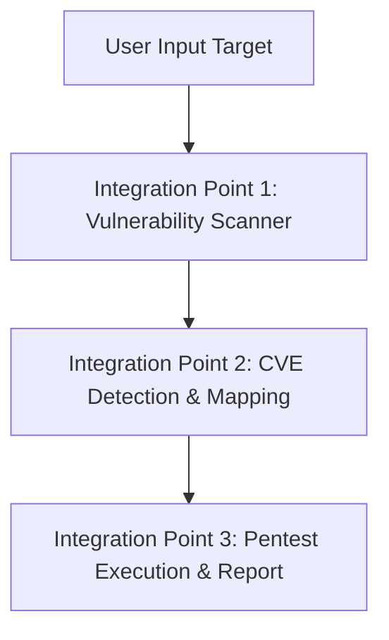

# 🔧 Panduan Integrasi Backend - AutoPentest

## 📋 Tujuan Dokumen

Dokumen ini menjelaskan **secara detail** apa yang harus dilakukan oleh **Tim Backend** untuk mengintegrasikan sistem vulnerability scanning dan penetration testing dengan frontend AutoPentest yang sudah ada.

---

## 🎯 Overview Integrasi

### Apa yang Sudah Ada (Frontend)

✅ **UI/UX Lengkap**
- Form scan vulnerability
- Halaman pemilihan CVE
- Dashboard monitoring
- Real-time progress tracking
- Report viewer

✅ **API Endpoints (Dummy)**
- `/api/scan-vulnerability` - Return dummy CVE data
- `/api/start-pentest` - Terima job, masukkan ke queue
- Job queue system dengan sequential execution

### Apa yang Perlu Dibuat (Backend)

❌ **Vulnerability Scanner Integration**  
❌ **CVE Database/Detection System**  
❌ **Client.py Execution & Monitoring**  
❌ **Report Generation System**  

---

## 🔌 Integration Points

Ada **3 Integration Points** utama yang harus dikerjakan:



---

## 📍 Integration Point 1: Vulnerability Scanner

### Lokasi Kode

- **File**: `Frontend/app.py`
- **Function**: `api_scan_vulnerability()` (line 185–292)
- **Endpoint**: `POST /api/scan-vulnerability`

### Current Implementation (Dummy)

```python
@app.route('/api/scan-vulnerability', methods=['POST'])
def api_scan_vulnerability():
    data = request.get_json()
    targets = data.get('targets', [])

    # ⚠️ DUMMY DATA - PERLU DIGANTI
    dummy_results = [
        {
            "id": "CVE12_2122",
            "name": "MySQL Auth Bypass",
            "description": "Authentication bypass vulnerability in MySQL",
            "severity": "High",
            "cvss": "7.5",
            "target": targets[0]
        }
    ]

    return jsonify({
        "status": "success",
        "message": f"Scan completed for {len(targets)} target(s)",
        "results": dummy_results
    })
```

### ✅ Yang Harus Dilakukan Backend

#### 1.1 Implementasi Vulnerability Scanner

**Pilihan Tools:**
- **Nmap** — Port scanning & service detection
- **Nikto** — Web vulnerability scanner
- **OpenVAS** — Comprehensive vulnerability scanner
- **Nuclei** — Template-based scanner

**Contoh Implementasi dengan Nmap:**

```python
import nmap

class VulnerabilityScanner:
    def __init__(self):
        self.nm = nmap.PortScanner()

    def scan_target(self, target_ip):
        """Scan single target untuk detect services & versions"""
        try:
            self.nm.scan(target_ip, arguments='-sV -sC --script vuln')
            results = []

            if target_ip in self.nm.all_hosts():
                for proto in self.nm[target_ip].all_protocols():
                    for port in self.nm[target_ip][proto].keys():
                        service = self.nm[target_ip][proto][port]
                        vulns = self.detect_vulnerabilities(
                            service['name'],
                            service.get('version', ''),
                            port
                        )
                        results.extend(vulns)

            return results

        except Exception as e:
            print(f"Scan error: {e}")
            return []

    def detect_vulnerabilities(self, service_name, version, port):
        """Map service & version ke CVE yang tersedia"""
        vulnerabilities = []

        # Contoh: Detect MySQL vulnerability
        if 'mysql' in service_name.lower():
            if self.is_vulnerable_mysql_version(version):
                vulnerabilities.append({
                    "id": "CVE12_2122",
                    "name": "MySQL Auth Bypass",
                    "description": f"Authentication bypass in MySQL {version}",
                    "severity": "High",
                    "cvss": "7.5",
                    "port": port,
                    "service": service_name,
                    "version": version
                })

        # Contoh: Detect Cacti vulnerability
        if 'cacti' in service_name.lower() or port == 80:
            vulnerabilities.append({
                "id": "CVE22_46169",
                "name": "Cacti RCE",
                "description": "Remote Code Execution in Cacti",
                "severity": "Critical",
                "cvss": "9.8",
                "port": port,
                "service": service_name,
                "version": version
            })

        return vulnerabilities

    def is_vulnerable_mysql_version(self, version):
        """Check if MySQL version is vulnerable to CVE-2012-2122"""
        vulnerable_versions = ['5.1', '5.5']
        return any(v in version for v in vulnerable_versions)
```

#### 1.2 Update API Endpoint

```python
@app.route('/api/scan-vulnerability', methods=['POST'])
def api_scan_vulnerability():
    data = request.get_json()
    targets = data.get('targets', [])
    project_name = data.get('project_name')

    if not targets:
        return jsonify({"status": "error", "message": "No targets provided"}), 400

    try:
        # ✅ IMPLEMENTASI BARU
        scanner = VulnerabilityScanner()
        all_results = []

        for target in targets:
            scan_results = scanner.scan_target(target)
            for result in scan_results:
                result['target'] = target
                all_results.append(result)

        session['scan_data'] = {
            'project_name': project_name,
            'username': data.get('username'),
            'description': data.get('description'),
            'targets': targets,
            'scan_timestamp': datetime.now().isoformat()
        }

        return jsonify({
            "status": "success",
            "message": f"Scan completed for {len(targets)} target(s)",
            "results": all_results
        })

    except Exception as e:
        return jsonify({"status": "error", "message": f"Scan failed: {str(e)}"}), 500
```

#### 1.3 Input/Output Contract

**INPUT dari Frontend:**
```json
{
  "project_name": "My Pentest Project",
  "username": "admin",
  "description": "Testing internal network",
  "targets": ["192.168.1.10", "192.168.1.20"]
}
```

**OUTPUT yang Diharapkan Frontend:**
```json
{
  "status": "success",
  "message": "Scan completed for 2 target(s)",
  "results": [
    {
      "id": "CVE12_2122",
      "name": "MySQL Auth Bypass",
      "description": "Authentication bypass vulnerability in MySQL 5.5",
      "severity": "High",
      "cvss": "7.5",
      "target": "192.168.1.10",
      "port": 3306,
      "service": "mysql",
      "version": "5.5.62"
    },
    {
      "id": "CVE22_46169",
      "name": "Cacti RCE",
      "description": "Remote Code Execution in Cacti 1.2.22",
      "severity": "Critical",
      "cvss": "9.8",
      "target": "192.168.1.10",
      "port": 80,
      "service": "http",
      "version": "Apache/2.4.41"
    }
  ]
}
```

**Field Wajib dalam setiap item `results[]`:**

| Field | Tipe | Keterangan |
|-------|------|------------|
| `id` | string | CVE ID — **harus match** dengan nama file di folder `CVE/` |
| `name` | string | Nama vulnerability |
| `description` | string | Deskripsi singkat |
| `severity` | string | `High` / `Critical` / `Medium` / `Low` |
| `cvss` | string | CVSS score, contoh: `"7.5"` |
| `target` | string | Target IP/URL yang diinput user |

**Field Optional:**

| Field | Keterangan |
|-------|------------|
| `port` | Port number service |
| `service` | Nama service |
| `version` | Versi service |

---

## 📍 Integration Point 2: CVE Detection & Mapping

### Lokasi Kode

- **File**: `Frontend/templates/select_cve.html`
- **Function**: `selectCVE()` (line 146–254)

### Current Implementation (Hardcoded)

```javascript
availableCVEs: [
  { id: 'CVE12_2122', name: 'MySQL Auth Bypass', ... },
  { id: 'CVE22_46169', name: 'Cacti RCE', ... }
]
```

> [!WARNING]
> Daftar CVE ini **hardcoded** di frontend dan harus diganti menjadi **dinamis** dari backend agar setiap CVE module baru langsung tersedia tanpa ubah kode frontend.

### ✅ Yang Harus Dilakukan Backend

#### 2.1 Buat CVE Database/Registry

**Option A: File-based (Simple — Direkomendasikan untuk permulaan)**

```python
# cve_registry.py
CVE_DATABASE = {
    "CVE12_2122": {
        "name": "MySQL Auth Bypass",
        "description": "Authentication bypass vulnerability in MySQL",
        "severity": "High",
        "cvss": "7.5",
        "affected_services": ["mysql"],
        "affected_versions": ["5.1.*", "5.5.*"],
        "module_path": "CVE/CVE12_2122.py",
        "references": [
            "https://cve.mitre.org/cgi-bin/cvename.cgi?name=CVE-2012-2122"
        ]
    },
    "CVE22_46169": {
        "name": "Cacti RCE",
        "description": "Remote Code Execution in Cacti",
        "severity": "Critical",
        "cvss": "9.8",
        "affected_services": ["http", "cacti"],
        "affected_versions": ["1.2.22", "1.2.23"],
        "module_path": "CVE/CVE22_46169.py",
        "references": [
            "https://nvd.nist.gov/vuln/detail/CVE-2022-46169"
        ]
    }
}

def get_cve_info(cve_id):
    return CVE_DATABASE.get(cve_id)

def get_all_cves():
    return CVE_DATABASE

def match_service_to_cves(service_name, version):
    matching_cves = []
    for cve_id, cve_data in CVE_DATABASE.items():
        if service_name.lower() in [s.lower() for s in cve_data['affected_services']]:
            if any(v in version for v in cve_data['affected_versions']):
                matching_cves.append({"id": cve_id, **cve_data})
    return matching_cves
```

**Option B: Database (Scalable)**

```python
# models.py
from sqlalchemy import Column, String, Float, JSON
from database import Base

class CVE(Base):
    __tablename__ = 'cves'

    id = Column(String, primary_key=True)   # CVE12_2122
    name = Column(String)
    description = Column(String)
    severity = Column(String)
    cvss = Column(Float)
    affected_services = Column(JSON)
    affected_versions = Column(JSON)
    module_path = Column(String)
    references = Column(JSON)
```

#### 2.2 Auto-scan CVE Modules Folder

```python
import importlib.util
from pathlib import Path

def scan_cve_modules():
    """Auto-detect available CVE modules dari folder CVE/"""
    cve_folder = Path("CVE")
    available_modules = []

    if not cve_folder.exists():
        return []

    for file in cve_folder.glob("CVE*.py"):
        module_name = file.stem  # e.g. CVE12_2122
        try:
            spec = importlib.util.spec_from_file_location(module_name, file)
            module = importlib.util.module_from_spec(spec)
            spec.loader.exec_module(module)

            metadata = getattr(module, 'METADATA', {})
            available_modules.append({
                "id": module_name,
                "name": metadata.get('name', module_name),
                "description": metadata.get('description', ''),
                "severity": metadata.get('severity', 'Unknown'),
                "cvss": metadata.get('cvss', '0.0'),
                "module_path": str(file)
            })
        except Exception as e:
            print(f"Error loading {module_name}: {e}")

    return available_modules
```

#### 2.3 Update Frontend dengan Dynamic CVE List

**Option 1: Inject ke Template (Server-side — lebih sederhana)**

```python
# app.py
@app.route('/select_cve')
def select_cve():
    if 'user' not in session:
        return redirect(url_for('login'))

    from cve_registry import get_all_cves
    available_cves = get_all_cves()

    return render_template(
        'select_cve.html',
        breadcrumb=[...],
        active_page='project',
        available_cves=available_cves   # ← Tambahkan ini
    )
```

```html
<!-- select_cve.html — ubah bagian availableCVEs -->
<script>
function selectCVE() {
  return {
    availableCVEs: {{ available_cves | tojson }},   // ← Ganti hardcoded
    // ... sisa kode tetap sama
  }
}
</script>
```

**Option 2: API Endpoint (Client-side)**

```python
# app.py — tambahkan route baru
@app.route('/api/available-cves')
def get_available_cves():
    from cve_registry import get_all_cves
    cves = get_all_cves()
    return jsonify({"status": "success", "cves": cves})
```

```javascript
// select_cve.html — ubah fungsi init()
async init() {
    const response = await fetch('/api/available-cves');
    const data = await response.json();
    this.availableCVEs = data.cves;   // ← Ambil dari API

    const scanData = sessionStorage.getItem('scan_results');
    if (!scanData) {
        window.location.href = "{{ url_for('scan_vulnerability') }}";
        return;
    }
    const data2 = JSON.parse(scanData);
    this.projectInfo = data2;
    this.targets = data2.targets || [];
    this.selectedCVEs = this.targets.map(() => []);
},
```

---

## 📍 Integration Point 3: Pentest Execution & Report

### Lokasi Kode

- **File**: `Frontend/app.py`
- **Function**: `job_worker()` (line 896–1008)

### Current Implementation

```python
def job_worker():
    while True:
        job_data = job_queue.get(timeout=1)
        command = [
            python_exec, "-u", client_script,
            "--ip", job_data['target_ip'],
            "--cve", job_data['cve_module']
        ]
        process = subprocess.Popen(command, ...)
        for line in process.stdout:
            log_file.write(line)
        if return_code == 0:
            update_job_status(job_id, 'completed', ...)
```

### ✅ Yang Harus Dilakukan Backend

#### 3.1 Pastikan Client.py Kompatibel

> [!IMPORTANT]
> Frontend memanggil `Client.py` menggunakan `--ip` dan `--cve` sebagai argumen. Client.py **wajib** mendukung format ini persis.

```python
# Client.py
import argparse
import sys

def main():
    parser = argparse.ArgumentParser(description='AutoPentest Client')

    # ✅ WAJIB: argparse dengan nama argumen ini
    parser.add_argument('--ip', required=True, help='Target IP address')
    parser.add_argument('--cve', required=True, help='CVE module to execute')

    args = parser.parse_args()
    result = execute_pentest(args.ip, args.cve)

    # ✅ WAJIB: exit code 0 = sukses, non-zero = gagal
    sys.exit(0 if result and result.get('success') else 1)


def execute_pentest(target_ip, cve_module):
    # ✅ WAJIB: Print progress agar bisa dimonitor
    print(f"[*] Starting pentest: {cve_module}")
    print(f"[*] Target: {target_ip}")

    try:
        exploit = import_cve_module(cve_module)
        result = exploit.run(target_ip)
        print(f"[+] Pentest completed")
        return result
    except Exception as e:
        print(f"[-] Error: {e}")
        return None


if __name__ == '__main__':
    main()
```

**Format output yang diperlukan untuk monitoring (print ke stdout):**

```
[*] Starting pentest: CVE12_2122
[*] Target: 192.168.1.10
[*] Loading exploit module...
[*] Checking target availability...
[+] Target is reachable
[*] Attempting exploitation...
[+] Exploitation successful!
[+] Access gained: root@192.168.1.10
[+] Pentest completed
```

#### 3.2 Struktur CVE Module (Wajib Diikuti Semua Modul)

```python
# CVE/CVE12_2122.py

# ✅ WAJIB: METADATA untuk auto-detection
METADATA = {
    "name": "MySQL Auth Bypass",
    "description": "Authentication bypass vulnerability in MySQL 5.1/5.5",
    "severity": "High",
    "cvss": "7.5",
    "references": [
        "https://cve.mitre.org/cgi-bin/cvename.cgi?name=CVE-2012-2122"
    ]
}


class Exploit:
    def __init__(self, target_ip):
        self.target = target_ip
        self.port = 3306

    def check_vulnerable(self):
        """Check if target is vulnerable"""
        # TODO: implementasi pengecekan
        pass

    def exploit(self):
        """Execute exploit"""
        # TODO: implementasi eksploitasi
        pass

    def run(self):
        """Main execution — dipanggil oleh Client.py"""
        print(f"[*] Checking if {self.target} is vulnerable...")

        if self.check_vulnerable():
            print(f"[+] Target is vulnerable!")
            result = self.exploit()
            if result:
                print(f"[+] Exploitation successful!")
                return {"success": True, "data": result}
            else:
                print(f"[-] Exploitation failed")
                return {"success": False}
        else:
            print(f"[-] Target is not vulnerable")
            return {"success": False}


# ✅ WAJIB: Entry point ini dipanggil oleh Client.py
def run(target_ip):
    exploit = Exploit(target_ip)
    return exploit.run()
```

#### 3.3 Report Generation (Auto setelah Job Selesai)

```python
# report_generator.py
from reportlab.lib.pagesizes import letter
from reportlab.lib.styles import getSampleStyleSheet
from reportlab.platypus import SimpleDocTemplate, Paragraph, Spacer
from pathlib import Path
from datetime import datetime


class PentestReportGenerator:
    def __init__(self, job_data):
        self.job = job_data
        self.report_dir = Path("reports")
        self.report_dir.mkdir(exist_ok=True)

    def generate(self):
        """Generate PDF report, kembalikan path file"""
        filename = f"{self.job['project_name']}_Report.pdf"
        filepath = self.report_dir / filename

        doc = SimpleDocTemplate(str(filepath), pagesize=letter)
        story = []
        styles = getSampleStyleSheet()

        # Title
        story.append(Paragraph(f"<b>Penetration Test Report</b><br/>{self.job['project_name']}", styles['Title']))
        story.append(Spacer(1, 20))

        # Summary
        story.append(Paragraph(
            f"<b>Executive Summary</b><br/>"
            f"Target: {self.job['target_ip']}<br/>"
            f"CVE Module: {self.job['cve_module']}<br/>"
            f"Status: {self.job['status']}<br/>"
            f"Date: {self.job['created_at']}<br/>",
            styles['Normal']
        ))
        story.append(Spacer(1, 20))

        # Execution log
        log_path = Path("jobs") / f"{self.job['job_id']}.log"
        if log_path.exists():
            with open(log_path, 'r') as f:
                log_content = f.read()
            story.append(Paragraph(f"<b>Execution Log</b><br/><pre>{log_content}</pre>", styles['Code']))

        doc.build(story)
        return str(filepath)
```

**Integrasikan ke `job_worker()` di `app.py`:**

```python
# Setelah return_code == 0, tambahkan:
if return_code == 0:
    try:
        from report_generator import PentestReportGenerator
        generator = PentestReportGenerator(job_data)
        report_path = generator.generate()

        update_job_status(
            job_id,
            'completed',
            finished_at=datetime.now().strftime('%Y-%m-%d %H:%M:%S'),
            progress=100,
            return_code=return_code,
            report_path=report_path   # ← Simpan path report
        )
    except Exception as e:
        print(f"Report generation failed: {e}")
        update_job_status(job_id, 'completed', ...)
```

---

## 🗂️ Struktur Folder Backend yang Direkomendasikan

```
Backend/  (atau letakkan di root project)
├── scanner/
│   ├── __init__.py
│   ├── vulnerability_scanner.py    # Nmap/Nikto integration
│   └── service_detector.py         # Service version detection
├── cve/
│   ├── __init__.py
│   ├── cve_registry.py             # CVE database
│   ├── cve_matcher.py              # Service ke CVE matching
│   └── cve_loader.py               # Dynamic module loading
├── pentest/
│   ├── __init__.py
│   ├── Client.py                   # Main pentest executor
│   └── CVE/
│       ├── CVE12_2122.py
│       ├── CVE22_46169.py
│       └── ...
├── reports/
│   ├── __init__.py
│   └── report_generator.py         # PDF generation
└── requirements_backend.txt
```

---

## 📌 Lokasi Penempatan File di Project Ini

> [!IMPORTANT]
> Project ini **hanya memiliki satu folder**: `Frontend/`. Semua file backend **harus ditempatkan di dalam `Frontend/`** agar bisa diimport langsung oleh `app.py` yang sudah ada.

### Struktur Akhir Setelah Backend Ditambahkan

```
KerBeng-frontend-final-main/
├── README.md
├── PANDUAN_BACKEND_INTEGRATION.md
└── Frontend/
    ├── app.py                          ← DIMODIFIKASI (tambah import scanner & registry)
    ├── requirements.txt                ← DIMODIFIKASI (tambah python-nmap, reportlab)
    │
    ├── Client.py                       ← DIBUAT BARU oleh backend
    │
    ├── scanner/                        ← FOLDER BARU (buat oleh backend)
    │   ├── __init__.py
    │   ├── vulnerability_scanner.py
    │   └── service_detector.py
    │
    ├── cve_registry.py                 ← FILE BARU (letakkan di samping app.py)
    │
    ├── report_generator.py             ← FILE BARU (letakkan di samping app.py)
    │
    ├── CVE/                            ← FOLDER BARU (buat oleh backend)
    │   ├── CVE12_2122.py
    │   ├── CVE22_46169.py
    │   └── ... (tambah modul CVE lainnya)
    │
    ├── jobs/                           ← SUDAH ADA (jangan diubah)
    ├── reports/                        ← SUDAH ADA (PDF akan disimpan di sini)
    └── templates/                      ← SUDAH ADA (modifikasi select_cve.html saja)
```

### Panduan Per File

| File / Folder | Aksi | Lokasi Absolut |
|---|---|---|
| `Client.py` | **Buat baru** | `Frontend/Client.py` |
| `scanner/` | **Buat folder baru** | `Frontend/scanner/` |
| `scanner/vulnerability_scanner.py` | **Buat baru** | `Frontend/scanner/vulnerability_scanner.py` |
| `cve_registry.py` | **Buat baru** | `Frontend/cve_registry.py` |
| `report_generator.py` | **Buat baru** | `Frontend/report_generator.py` |
| `CVE/` | **Buat folder baru** | `Frontend/CVE/` |
| `CVE/CVE12_2122.py` | **Buat baru** | `Frontend/CVE/CVE12_2122.py` |
| `CVE/CVE22_46169.py` | **Buat baru** | `Frontend/CVE/CVE22_46169.py` |
| `app.py` | **Modifikasi** | `Frontend/app.py` (sudah ada) |
| `requirements.txt` | **Modifikasi** | `Frontend/requirements.txt` (sudah ada) |
| `templates/select_cve.html` | **Modifikasi** | `Frontend/templates/select_cve.html` (sudah ada) |

### Lokasi Import di `app.py`

Setelah file backend dibuat, tambahkan import berikut di **bagian atas** `Frontend/app.py` (setelah baris `from dotenv import load_dotenv`):

```python
# ─── BACKEND INTEGRATION: tambahkan import ini ───────────────────────
from scanner.vulnerability_scanner import VulnerabilityScanner
from cve_registry import get_all_cves, match_service_to_cves
from report_generator import PentestReportGenerator
# ─────────────────────────────────────────────────────────────────────
```

### Auto-discovery Client.py

`app.py` sudah memiliki fungsi `find_client_script()` yang akan **otomatis mencari** `Client.py` di lokasi berikut (berurutan):

```python
candidates = [
    "./Client.py",          # ← Frontend/Client.py  ✅ Taruh di sini
    "./Pentest/Client.py",
    "./pentest/Client.py",
]
```

> [!TIP]
> Letakkan `Client.py` langsung di `Frontend/Client.py` (satu level dengan `app.py`). Tidak perlu mengubah konfigurasi apapun — `app.py` akan menemukannya secara otomatis.

### Lokasi CVE Modules

`Client.py` harus mencari modul CVE dari folder `Frontend/CVE/`. Pastikan path di dalam `Client.py` menggunakan path relatif:

```python
# Di dalam Client.py
import importlib.util
import os

def import_cve_module(cve_id):
    """Import CVE module dari folder CVE/ (relatif terhadap Client.py)"""
    base_dir = os.path.dirname(os.path.abspath(__file__))
    module_path = os.path.join(base_dir, "CVE", f"{cve_id}.py")

    spec = importlib.util.spec_from_file_location(cve_id, module_path)
    module = importlib.util.module_from_spec(spec)
    spec.loader.exec_module(module)
    return module
```

### Update `requirements.txt`

Tambahkan dependencies backend ke **`Frontend/requirements.txt`** yang sudah ada:

```txt
# Sudah ada:
Flask==3.0.3
...

# ← Tambahkan baris berikut:
python-nmap==0.7.1
reportlab==4.0.7
requests==2.31.0
python-dotenv==1.0.0
```

---

## 📦 Dependencies Backend

```txt
# requirements_backend.txt

# Scanning
python-nmap==0.7.1
requests==2.31.0

# Report Generation
reportlab==4.0.7
python-docx==1.1.0

# Database (opsional)
sqlalchemy==2.0.23
alembic==1.13.1

# Utilities
python-dotenv==1.0.0
pyyaml==6.0.1
```

```bash
pip install python-nmap requests reportlab python-docx python-dotenv pyyaml
```

---

## 🔄 Roadmap Implementasi

### Phase 1 — Vulnerability Scanner (Week 1)

1. Install dependencies: `python-nmap`
2. Buat `VulnerabilityScanner` class
3. Implementasi `scan_target()` method
4. Update endpoint `/api/scan-vulnerability`
5. Test dengan real target di lab environment
6. Handle errors & timeouts

### Phase 2 — CVE Database (Week 2)

1. Buat `cve_registry.py` dengan CVE database lengkap
2. Implementasi `match_service_to_cves()`
3. Auto-scan `CVE/` folder untuk deteksi modul
4. Update `VulnerabilityScanner` agar gunakan registry
5. Update frontend agar CVE list dinamis

### Phase 3 — Pentest Execution (Week 3)

1. Standardize `Client.py` argparse interface
2. Tambahkan `METADATA` di semua CVE modules
3. Implementasi consistent output format (`[*]`, `[+]`, `[-]`)
4. Test sequential execution dengan 2 targets
5. Verifikasi log streaming berjalan real-time

### Phase 4 — Report Generation (Week 4)

1. Install `reportlab`
2. Buat `PentestReportGenerator` class
3. Integrasikan ke `job_worker()` di `app.py`
4. Test PDF generation
5. Verifikasi fitur download & view report di dashboard

---

## 🧪 Testing Checklist

### Unit Tests

```python
# test_scanner.py
def test_scan_target():
    scanner = VulnerabilityScanner()
    results = scanner.scan_target("192.168.1.10")
    assert len(results) > 0
    assert all('id' in r for r in results)
    assert all('severity' in r for r in results)

# test_cve_matcher.py
def test_match_service():
    cves = match_service_to_cves("mysql", "5.5.62")
    assert "CVE12_2122" in [c['id'] for c in cves]

# test_report_generator.py
def test_generate_report():
    job_data = {
        "job_id": "test_job_001",
        "project_name": "Test Project",
        "target_ip": "192.168.1.10",
        "cve_module": "CVE12_2122",
        "status": "completed",
        "created_at": "2024-01-01 12:00:00"
    }
    generator = PentestReportGenerator(job_data)
    report_path = generator.generate()
    assert Path(report_path).exists()
```

### Integration Test

```python
# test_integration.py
def test_full_workflow():
    # 1. Scan vulnerability
    response = client.post('/api/scan-vulnerability', json={
        "project_name": "Test",
        "targets": ["192.168.1.10"]
    })
    assert response.status_code == 200
    results = response.json()['results']
    assert len(results) > 0

    # 2. Start pentest
    response = client.post('/api/start-pentest', json={
        "project_name": "Test",
        "targets": [{
            "target_ip": "192.168.1.10",
            "cve_module": results[0]['id']
        }]
    })
    assert response.status_code == 200
    assert response.json()['status'] == 'success'
```

---

## 🚨 Error Handling

### Scanner Errors

```python
try:
    results = scanner.scan_target(target)
except nmap.PortScannerError as e:
    return jsonify({
        "status": "error",
        "message": f"Scan failed: {str(e)}",
        "error_type": "scanner_error"
    }), 500
except TimeoutError:
    return jsonify({
        "status": "error",
        "message": "Scan timeout - target unreachable",
        "error_type": "timeout"
    }), 504
```

### CVE Execution Errors

```python
# Di Client.py
try:
    result = exploit.run(target_ip)
except ModuleNotFoundError:
    print(f"[-] CVE module not found: {cve_module}")
    sys.exit(2)   # Exit code 2 = module error
except Exception as e:
    print(f"[-] Exploitation error: {e}")
    sys.exit(1)   # Exit code 1 = general error
```

---

## 📊 Monitoring & Logging

```python
import logging

logging.basicConfig(
    level=logging.INFO,
    format='%(asctime)s [%(levelname)s] %(message)s',
    handlers=[
        logging.FileHandler('backend.log'),
        logging.StreamHandler()
    ]
)

logger = logging.getLogger(__name__)

# Contoh penggunaan
logger.info(f"Starting scan for target: {target_ip}")
logger.warning(f"No CVEs found for service: {service_name}")
logger.error(f"Scan failed: {error}")
```

---

## 🔐 Security Considerations

### Input Validation (Wajib Diimplementasikan)

```python
import ipaddress
import re

def validate_target(target):
    """Validasi bahwa target adalah IP atau domain yang sah"""
    try:
        ipaddress.ip_address(target)
        return True
    except ValueError:
        pattern = r'^[a-zA-Z0-9]([a-zA-Z0-9-]{0,61}[a-zA-Z0-9])?(\.[a-zA-Z]{2,})+$'
        return bool(re.match(pattern, target))

def validate_cve_module(cve_id):
    """Validasi format CVE ID agar tidak ada path traversal"""
    pattern = r'^CVE[0-9]{2}_[0-9]+$'
    return bool(re.match(pattern, cve_id))
```

> [!CAUTION]
> **Selalu validasi** input `target` dan `cve_module` sebelum dieksekusi sebagai subprocess. Tanpa validasi, sistem rentan terhadap command injection.

### Sandbox Execution (Opsional tapi Direkomendasikan)

```python
import docker

def execute_in_sandbox(cve_module, target_ip):
    """Jalankan pentest di dalam Docker container yang terisolasi"""
    client = docker.from_env()

    container = client.containers.run(
        "pentest-sandbox:latest",
        command=f"python Client.py --ip {target_ip} --cve {cve_module}",
        detach=True,
        network_mode="bridge",
        mem_limit="512m",
        cpu_quota=50000
    )

    container.wait()
    logs = container.logs().decode('utf-8')
    container.remove()
    return logs
```

---

## ✅ Deliverables Checklist

### Week 1 — Vulnerability Scanner
- [ ] `VulnerabilityScanner` class diimplementasikan
- [ ] `/api/scan-vulnerability` return hasil scan nyata (bukan dummy)
- [ ] Unit tests lulus
- [ ] Dokumentasi diupdate

### Week 2 — CVE Database
- [ ] `cve_registry.py` dibuat dengan semua CVE tersedia
- [ ] Service-to-CVE matching berfungsi
- [ ] Daftar CVE di frontend sudah dinamis
- [ ] Integration tests lulus

### Week 3 — Pentest Execution
- [ ] `Client.py` sudah support `--ip` dan `--cve`
- [ ] Semua CVE modules punya `METADATA` dan fungsi `run(target_ip)`
- [ ] Sequential execution berjalan tanpa error
- [ ] Log streaming terverifikasi

### Week 4 — Report Generation
- [ ] `PentestReportGenerator` diimplementasikan
- [ ] PDF report auto-generate setelah job selesai
- [ ] Fitur download & view PDF berfungsi di dashboard
- [ ] End-to-end testing selesai

---

## 🎯 Success Criteria

| Komponen | Target |
|----------|--------|
| **Vulnerability Scanner** | Scan < 60 detik, 95% akurasi service detection |
| **CVE Matching** | 90% akurasi, support minimal 10 CVE modules |
| **Pentest Execution** | Sequential tanpa race condition, log real-time |
| **Report Generation** | PDF dihasilkan < 5 detik, format profesional |

---

**Last Updated**: 2026-02-25  
**Version**: 1.0  
**Contact**: Backend Integration Team
